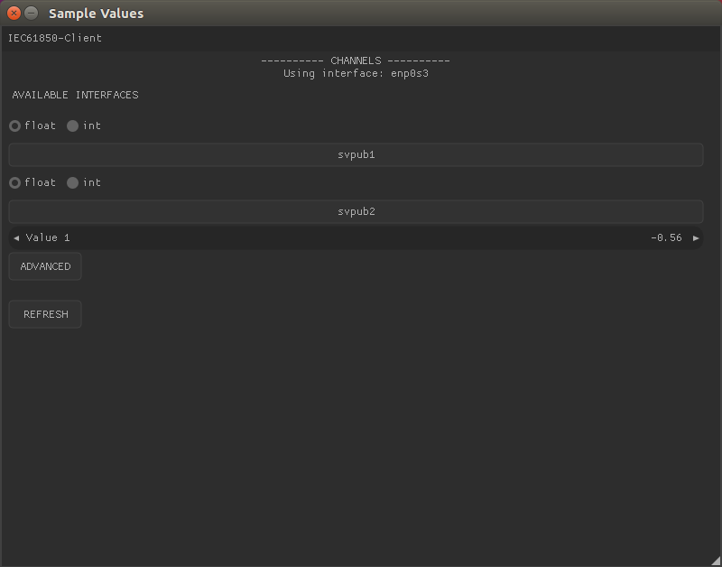
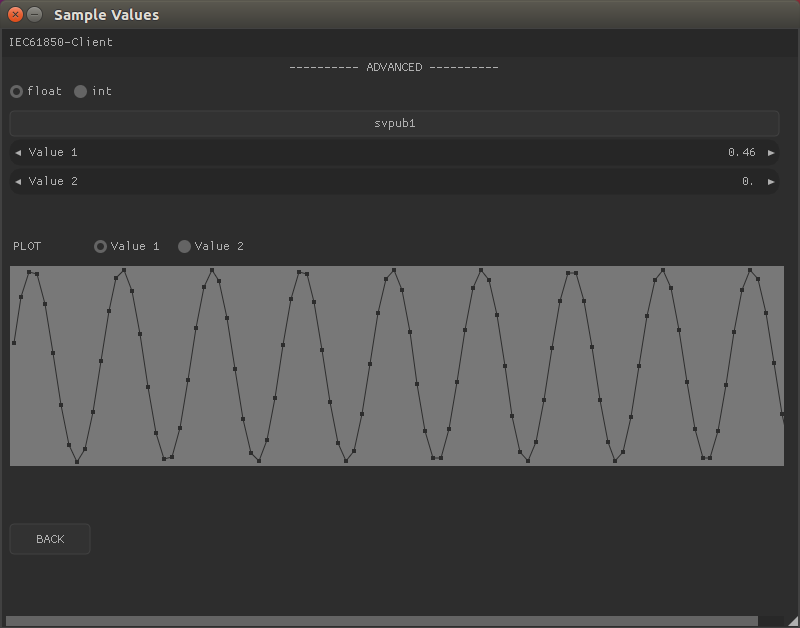

# IEC61850-Client




## How to use

The program displays all the IEC61850 channels available of the chosen interface.
New channels are automatically added and displayed. If one of channels stops broadcasting the last
received value vill be shown. After clicking the refresh button only active channels will be shown.

### Plotting

In order to plot the values received mark the wanted channel and click the button "Advanced".
Additional options as plotting and RMS vill be shown. Plot button have two options: "Start" and "Stop".
When plot is enabled graph will be updated continuously and RMS value will be calculated.

## Building
### Dependencies
- libiec61850 (_included in the source_)
- OpenGL (_should be included in a standard Linux distro_)
- SDL2
- GLEW
- Nuklear (_included in the source_)

*Install the dependencies*
```bash  
$ sudo apt-get install libsdl2-dev libglew-dev
```
then change in to the directory of the repository and ...
*Run*
```bash  
$ make && sudo ./main
```

The program needs to be run as sudo due to the low-level network access required
by libiec61850.

### Performance concerns
Given that the number of samples sent over the network quite easily can move into the thousands per seconds (50 hz * 256 samples/s = 12800 values/s) the performance of the program needs to be investigated. The normal build is unoptimized (add '-O3' to CXXFLAGS variable (line ~15) in the makefile for optimized builds).

Tested on Ubuntu 17.04.
